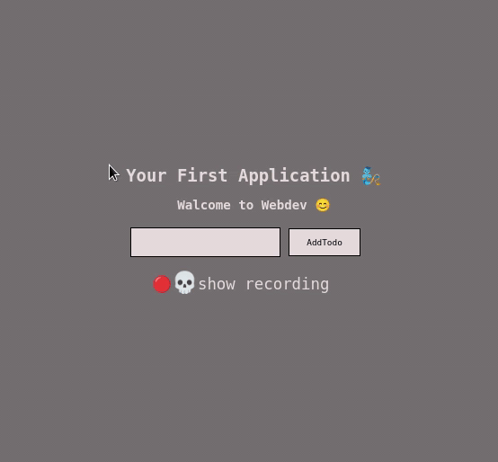

<div align="center">

#  Your First Application 🤟
## Walcome to Webdev 😊

<div>

<div align="center">

<div align="left">


---

### How to install

1. Click on green **Clone or download** button and choose Download ZIP.
2. Find the downloaded zipped file on your pc and extract it.
3. Then install nodejs in your local system
4. Open Roont Directory,
5. Rum commend.
> ```npm run start```
Once you are done  you can close the application in your terminal to quit the application.

---

</div>

### Todo List



</div>

> If you have any issues with that Application feel free to let me know!

> If you are more interested, check out the collection of [ **CLIsapplications**](https://github.com/DSDmark/CLIsapplications"CLIsapplications").
---