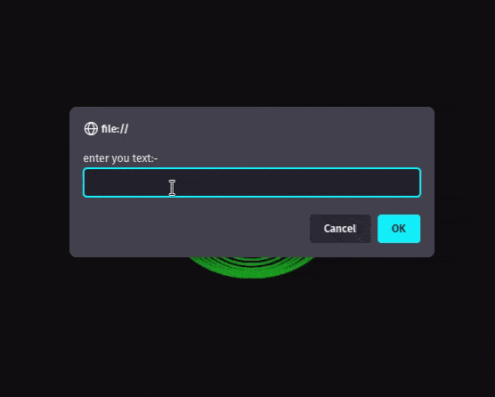

# SpringSimulation

---

## Purpose

> it's a simple spring animation main base on **css**

---

### How to play

1. Click on green **Clone or download** button and choose Download ZIP.
2. Find the downloaded zipped file on your pc and extract it.
3. Go to folder. Inside you will find a file named **index.html**.
4. Double-click on **index.html** file and your browser will open (or maybe just a new tab) and the game will start.
5. If for whatever reason your browser does not open, right click on **index.html** file go down to **Open with**
   and choose your web browser. This will open the browser and launch the game.

Once you are done playing, you can close the tab in your browser to quit the game.

---

### SpringSimulation

> If you have any issues with the game feel free to let me know!

> If you are more interested, check out the collection of [ **DSDmark**](https://github.com/DSDmark "DSDmark").

---

